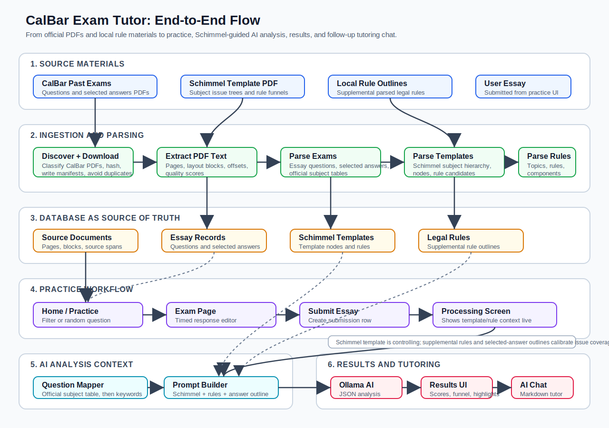

# CalBar Exam Tutor

Local California Bar essay practice app for ingesting official exam PDFs, parsing questions and selected answers, mapping questions to Schimmel essay templates and supplemental rules, grading user essays with AI, and supporting follow-up tutoring chat.

## What Exists

- CalBar past-exams crawler with PDF classification and dry-run manifest output.
- Safe downloader with retries, PDF validation, SHA-256, atomic writes, and JSONL manifests.
- SQLAlchemy/Alembic schema for source documents, pages, layout blocks, essays, answers, legal subjects/topics/rules/components, and source spans.
- PyMuPDF page/block extraction with extraction-quality scores.
- Deterministic essay/selected-answer parser supporting interleaved question/answer PDFs.
- Schimmel template parser and question-to-template mapper.
- Deterministic Trusts outline parser using headings, font/layout signals, bullets, and rule cues.
- Practice web UI with question filtering, random-question selection, timed essay submission, processing status, score breakdowns, rule funnels, essay-highlight feedback, and analysis-grounded AI chat.
- Typer CLI commands for discovery, downloading, extraction, parsing, validation, review export, static data browser export, and serving the web app.
- Synthetic pytest coverage. No official PDFs or proprietary outline text are committed.

## End-to-End Flow



At a high level, the system does three linked jobs:

1. Ingest source material: official CalBar PDFs, Schimmel templates, and local rule outlines are extracted, parsed, deduped, and stored in Postgres.
2. Build analysis context: when a user submits an essay, the app maps the question to the official subject and Schimmel template, then adds Schimmel rule candidates, supplemental parsed rules, and selected-answer issue headings where available.
3. Tutor the user: the AI returns structured JSON for scores, issue analysis, rule funnels, essay-passage highlights, and follow-up chat grounded in the saved analysis.

## Setup

```bash
python3.12 -m venv .venv
source .venv/bin/activate
python -m pip install --upgrade pip
python -m pip install -e '.[dev]'
cp .env.example .env
```

With Docker:

```bash
docker compose up -d postgres
alembic upgrade head
```

Without Docker, point `DATABASE_URL` at any PostgreSQL 16 database.

## Entity Relationships

```text
source_documents
  -> document_pages
       -> page_blocks
  -> essay_questions
       -> selected_answers
  -> source_spans

legal_subjects
  -> legal_topics (self-referential parent_topic_id)
       -> legal_rules
            -> rule_components

source_spans polymorphically reference:
  legal_subject, legal_topic, legal_rule, rule_component,
  essay_question, selected_answer
```

## Commands

Discover February 2017 without downloading:

```bash
python -m app.cli discover-calbar \
  --dry-run \
  --year 2017 \
  --month february \
  --category ESSAY_QUESTIONS_AND_SELECTED_ANSWERS
```

Download the February 2017 selected essay PDF:

```bash
python -m app.cli download-calbar \
  --year 2017 \
  --month february \
  --category ESSAY_QUESTIONS_AND_SELECTED_ANSWERS \
  --limit 1
```

Run the first full vertical slice:

```bash
python -m app.cli run-pipeline \
  --year 2017 \
  --month february \
  --limit 1 \
  --trusts-file "data/input/trusts-outline.pdf"
```

If you keep the outline in the existing local folder, use:

```bash
python -m app.cli run-pipeline \
  --year 2017 \
  --month february \
  --limit 1 \
  --trusts-file "CalBarRules/FINAL REVIEW OUTLINES & FREQUENCY CHARTS/MEE.o.FRO.Trusts (2).pdf"
```

Inspect and export:

```bash
python -m app.cli validate-document --document-id 1
python -m app.cli export-review --document-id 1 --output data/parsed/feb2017.review.json
python -m app.cli export-review-html --document-id 1 --output data/parsed/feb2017.review.html
python -m app.cli export-data-browser-html --output data/parsed/parsed-data-browser.html
```

The HTML exports are static, local files. They provide a read-only review workbench with searchable essay questions, selected answers, legal rules, components, extraction quality, review status, confidence, and source-span quotes.

## Idempotency

- `source_documents` are keyed by source URL plus SHA-256 when a URL exists, otherwise local path plus SHA-256.
- Download manifests record status: `downloaded`, `unchanged`, `changed`, or `failed`.
- The downloader skips unchanged files when response validators match and writes changed same-URL content to a SHA-suffixed filename.
- Page, essay, answer, rule, component, and span records are replaced for the current parser version during reruns.
- Approved review data is not overwritten by the source-document registration helper.

## Verification Run

On this machine I verified:

```text
pytest: 11 passed
ruff: all checks passed
mypy: no issues found
```

I also ran the full vertical slice against a temporary PostgreSQL 16 cluster:

```text
Eligible essay documents: 1
Documents downloaded: 0
Documents unchanged: 1
Download failures: 0
Pages extracted: 104
Essay questions parsed: 6
Selected answers parsed: 12
Rule topics parsed: 61
Rules parsed: 239
Rule components parsed: 12
```

Validation summaries:

```text
Official February 2017 document:
  pages: 92
  essay_questions: 6
  selected_answers: 12
  source_spans: 18

Trusts outline:
  pages: 12
  legal_rules: 239
  rule_components: 12
  source_spans: 312
```

The Trusts parser marks 94 low-confidence rule records for review; that is expected for the first deterministic pass.

## Data Policy

Generated downloads, extracted JSON, parsed JSON, manifests, local outline PDFs, and `CalBarRules/` are gitignored. Commercial/user-provided outlines default to `PRIVATE_USE_ONLY` with `redistribution_allowed = false`.
